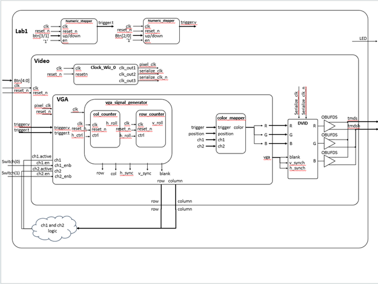
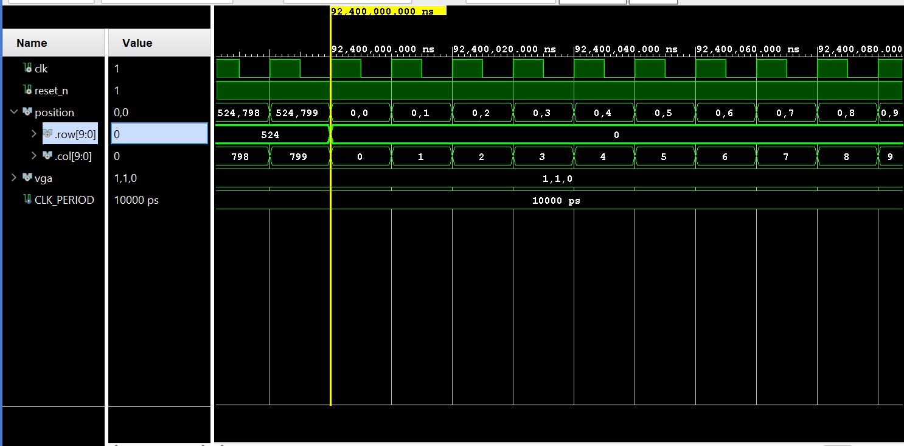
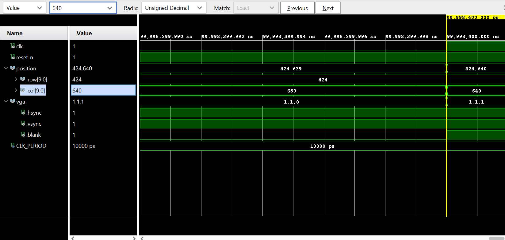
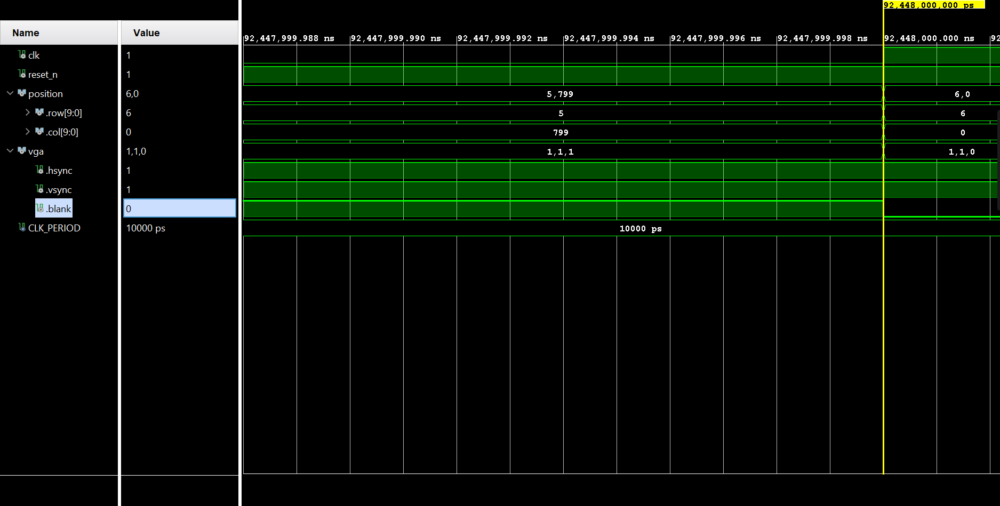
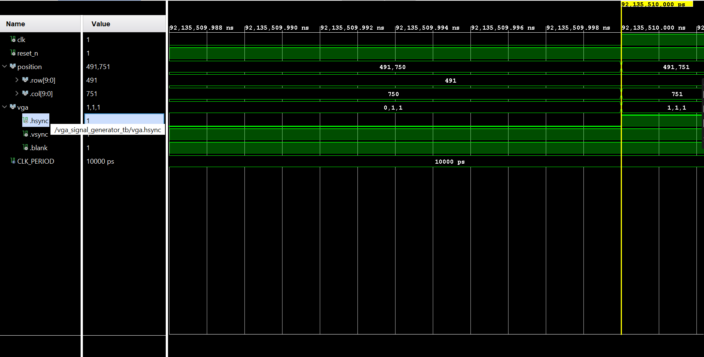
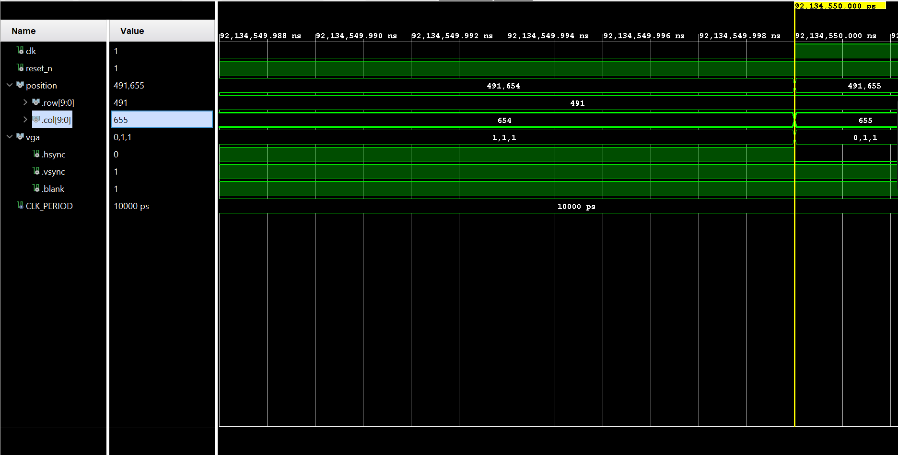
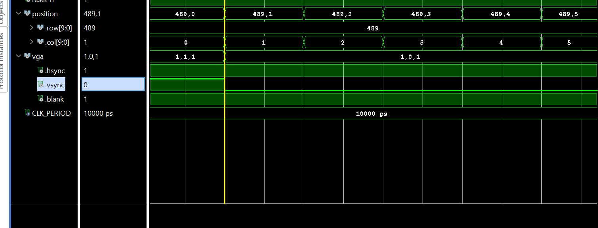
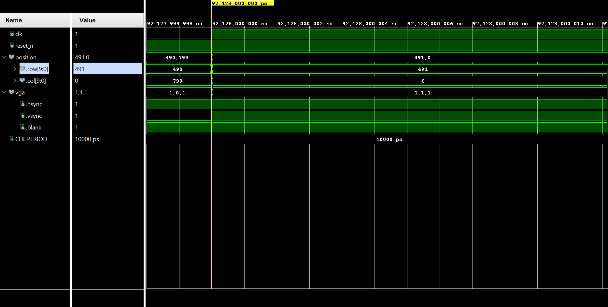
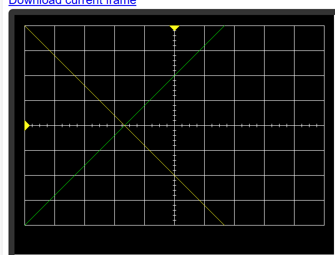

# Lab 1: VGA Synchronization

## Introduction:
The objective of this lab is to design and implement VGA controllers on FPGA development board. This VGA controller produces an oscilloscope display portion, which consists of a white grid, two trigger markers, and two artificially generated waveforms. This lab sets the stage for later labs, where the generated waveforms will be generated by real input source. 

## Design Implementation: 

### Oscilloscope Grid(Figure 1):

As shown, the grid is 640*480 pixels. X-axis is time, while Y-axis is volt.  The vertical lines are separated by 60 pixels, whereas the horizontal lines are separated by 50 pixels. Hash marks are drawn on both the x and y axes. 

### Block Diagram(Figure 2):

### Components: 
#### 1- Color Mapper:
The color mapper generates the R,G,B value of each pixel on the screen. It decides which color to output based on the row and column of the current pixel. When the current pixel is part of channel 1 signal or a trigger marker, the output is yellow; When the current pixel is part of channel 2 signal, the output is green. The oscilloscope’s grid is drawn with a white color. When the current pixel doesn’t correspond to any of the things mentioned above, the output is black, which is the background. 

Inputs/outputs:
Color: 24-bit color value for the current row and column
position.row: the row currently being processed.
position.col: the column currently being processed
trigger.t: This 11-bit signed value, representing the trigger time, is used to display a yellow arrow on the horizontal axis. 
trigger.v: This 11-bit signed value, representing the volt time, is used to display a yellow arrow on the horizontal axis. 
ch1.active: a 1-bit signal indicating whether to draw channel 1 signal. Its logic is implemented at the top level of this lab. The color mapper outputs a yellow pixel when this value is 1. Its logic is implemented at the top level of this lab. 
Ch1.enb: A 1-bit signal enabling channel 1 signal to be drawn. It’s connected to sw(0) at the top level
Ch2.active: a 1-bit signal indicating whether to draw channel 2 signal. Its logic is implemented at the top level of this lab. The color mapper outputs a green pixel when this value is 1. Its logic is implemented at the top level of this lab. 
Ch1.enb: A 1-bit signal enabling channel 1 signal to be drawn. It’s connected to sw(1) at the top level

#### 2- Counter: 
We have two counters inside the vga_signal_generator component to calculate the current row and column being displayed. The two counters are as follows:
Col_counter: Counts from 0 up to 799. 
Row_counter: counts from 0 up to 479.

We needed to connect the two counters so when col_counter reaches its maximum value and rolls back to zero, row_counter counts up by 1, indicating that displaying the current row is completed; and the displayer should move over to the next row. This is done by connecting the roll flag of the col_counter to the ctrl of the row_counter. 

Inputs/Outputs
Clk: Synchronize the entire system
reset_n: Reset the counter to zero.
Ctrl: controls the counter. If ctrl is 1, the counter counts. Otherwise, it stays at the same value. 
Roll: This flag is used to indicate when the counter rolls over. When the counter reaches its maximum value, it rolls to zero, which sets the roll flag to one. 

#### 3- Vga_signal_generator:
This component is used to sweep across the display from left to right and then returns to the left side of the next lower row. The current row and column that need to be displayed are determined by the row_counter and col_counter mentioned above. It determines the value of hsync, vsync, and blank using the values of current row and column. These signals are important to determine when pixels are displayed on the screen. 

Inputs/Outputs
Clk: This is the 25 MHz pixel clock generated by the DCM in the video module. 
reset_n: This is the same active high reset signal passed into the top level Lab1 module.
Position: This is a record of coordinate_t, which holds the current pixel row and col calculated by the two counters. 
Vga: This is a record of vga_t type which holds the hsync, vsync, and blank signals. 
	Hsync: It tells the screen that the current row is done. The screen then starts writing pixels to the next line
	Vsync: It tells the screen that the current video frame is done. The screen then starts writing pixels to the top-left corner of the screen. 
	Blank: This 1-bit signal indicates when pixels are displayed on the screen. When it’s low, pixels are displayed. 

#### 4- Vga:
This component serves as a container for vga_signal_generator and the color mapper modules. It receives critical inputs from the top-level component, including the position of trigger-time and trigger voltage, as well as channel enable and active signals, and pass these down to the lower-level modules. It then produces the current row and column using  the two counters, and the R,G, B values of the current pixel using the color mapper. The R,G, B values are then used in the video component to generate the tmds and tmdsb signals. These signals are used to transmit video frames over HDMI. 

clk: This is the 25 MHz pixel clock generated by the DCM in the video module. It’s used to synchronize the whole system.
reset_n : This is the same active high reset signal passed into the top level Lab1 module.
vga : This is a record of vga_t type which holds the hsync, vsync, and blank signals. This is produced by the vga_signal_generator module
 pixel : This is a record of the coordinates and color of the current pixel. The coordinates are produced by the vga_signal_generator, while the color is produced b the color mapper. 
trigger :  This is a record of trigger time and volt position. This value is passed along to the color mapper to display both triggers at the correct coordinates. 
 ch1 : Determines if the channel is active/enabled. The channel is enabled through sw(0) in the top level component. The channel is considered active when the current pixel corresponds to channel 1 waveform. This information is passed to color mapper to generate the correct RGB output for channel 1. 
  ch2 : Determines if the channel is active/enabled. The channel is enabled through sw(1) in the top-level component. The channel is considered active when the current pixel corresponds to channel 1 waveform. This information is passed to color mapper to generate the correct RGB output for channel 2.

#### 5- Numeric_stepper:
This module is used to increment or decrement the trigger position when the up or down button is pressed. It uses a counter to prevent debouncing. When the button is pressed, the signal generated from the button goes from low to high. The numeric_stepper then detects this transition and starts the counter using a local variable. The module then waits approximately 20 ms for the signal to settle before incrementing or decrementing the trigger position by a fixed step value. When resetted, both triggers will be positioned at the top left corner of the grid.

clk: This is the 25 MHz pixel clock generated by the DCM in the video module. It’s used to synchronize the whole system. 
reset_n: Used to reset the triggers to their default position (20,20). We can reset them by pressing the cpu_reset button on the FPGA development board. 
Up: Increment the trigger by a fixed step value (Delta).
down: decrement the trigger by a fixed step value (Delta).
En: In this lab, we set this value to 1, because we want the numeric_stepper to be working all the time. 
Q: The output of the numeric_stepper. 

#### 6- Lab 1
This module is the top-level component of Lab 1 and serves as the interface between the VHDL design and the physical FPGA development board. It acts as the integration point that connects and coordinates all submodules required to achieve the overall system functionality. The Lab1 module receives button inputs (Up, Down, Left, and Right) from the FPGA board. These buttons are used to adjust the trigger time and trigger voltage positions displayed on the screen. Button presses are passed to the time_numeric_stepper and volt_numeric_stepper modules, which determine the updated trigger positions for the next video frame. It also synchronizes the system using a 25 MHz pixel clock.  
1-	T_Numeric_stepper: Generates the position of the time trigger, used by the color mapper to draw the trigger time marker at the correct screen coordinates
2-	T_Numeric_stepper: Generates the position of the volt trigger, used by the color mapper to draw the trigger volt marker at the correct screen coordinates  
3-	Video: Integrates the VGA module, the DVID module, and the clock_wiz_0. The clock_wiz_0 is used to generate different clock signals at specific frequencies required by different parts of the system. The VGA module produces synchronization signals and pixel color data, which are then converted by the DVID module into TMDS signals for HDMI output. 

## Test/Debug:
In this lab, the instructor test benches and visual observation were primarily used to test/debug our VHDL design. 

### Counter Module
The first problem encountered was in the counter module. First, the counter rollover was off by one(It rolls over at max_value instead of max_value – 1). Second, the row counter was delayed by one clock cycle relative to the roll over for the col counter. We fixed these issues using a comprehensive test bench that tested the design against all the edge cases. After fixing these issues, the following waveforms were generated. 

This screenshot shows the col counter rolling back to zero after reaching its maximum value(Figure 3)

This screenshot shows the row counter rolling back to zero after reaching its maximum value and at the same clock cycle that col counter rolls over: (Figure 4)

### vga_signal_generator
Next, the provided test bench was used to test the output of the vga_signal_generator. This test bench was mainly used to test the proper transitions of hsync, vsync, and blank signals. The following waveforms were generated: 

Blank going high after the last column in the grid: (Figure 5) 

Blank goes low with the first column in the grid. (Figure 6)

H_sync goes high at the correct col number (Figure 7)

H_sync goes low at the correct col number (Figure 8)

Vsync goes low at the correct row number (Figure 9)

Vsync goes high at the correct row number (Figure 10)

### Oscilliscope Visualization
Afterwards, The  provided test bench to generate a log file that can be used to visualize what the output would look like on the screen. This helped verify the behavior of our color mapper and vga_signal_generator, allowing us to fix small bugs early  without testing directly on the hardware. The generated display from the website is provided below: 
(Figure 11)

### numeric_stepper
The last component tested was the numeric_stepper. This was done using visual observation after implementing the design on the FPGA board. The triggers were tested by observing how they are being displayed at the corners of the grid. Visual observation was also used to ensure there are no debouncing issues. 

## Results:
All the lab objectives were met. The following section summarizes the results, including the date and time achieved, the level of achievement, and the evidence used to verify functionality. 

### CG1
Completed in Lesson 6. Implemented both row and col counter using the counter module developed in previous homeworks. The required functionality of the counters was verified, including the correct rollover behavior of both counters, and that col counter roll over increments the row counter. Evidence for correct functionality are provided in figure 3 and 4 of the test/debug section.

### GC2
Completed in Lesson 7. Implemented the vga_signal_generator and the color mapper. For the color mapper, the correct transition for vsync, hsync, and blank were verified. This was evident in figure 5 through 10 provided in the test/debug section.
 The color mapper along with the vga_signal_generator were verified that function properly by submitting the log_file generated by the instructor_tb to an online website. The corrected output was displayed, as shown in figure 11. 

### Oscilliscope display using physical hardware
Completed in Lesson 8. The oscilloscope grid, hash marks, triggers, and channel signals were successfully displayed. The channels' visibility were controlled using switches 0 and 1. The triggers were successfully controlled using the physical buttons on the boards, while ensuring that they remain within the grid boundaries. This was verified by a live demo to myself. 

## Conclusion: 
This lab builds the foundation of how video system design works. One big takeaway was the importance of modular design. Separating the system into submodules made it much easier to test/debug each component separately well before system integration. For future iterations of the lab, the provided submodules were organized and the instructor test benches were very helpful in validating each submodule. I would recommend giving some guidance on how the arrows should be drawn, as this aspect was challenging for most of us.   

