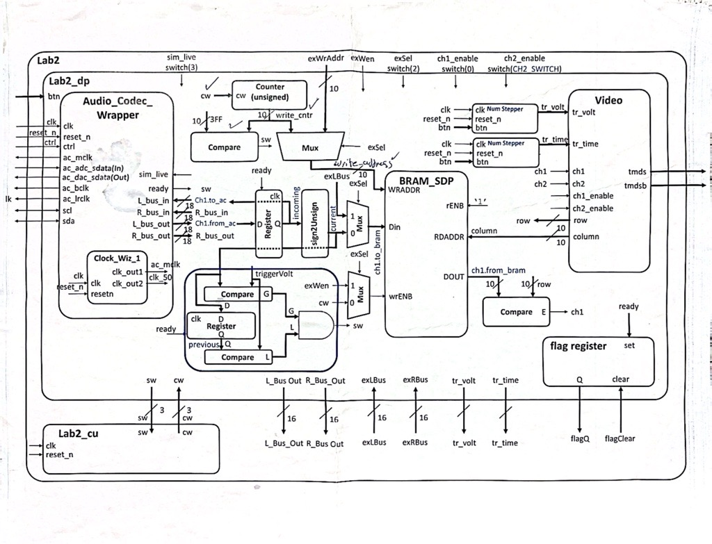
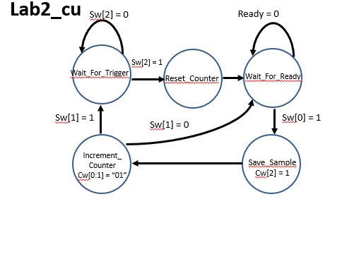
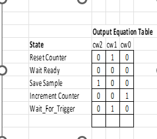
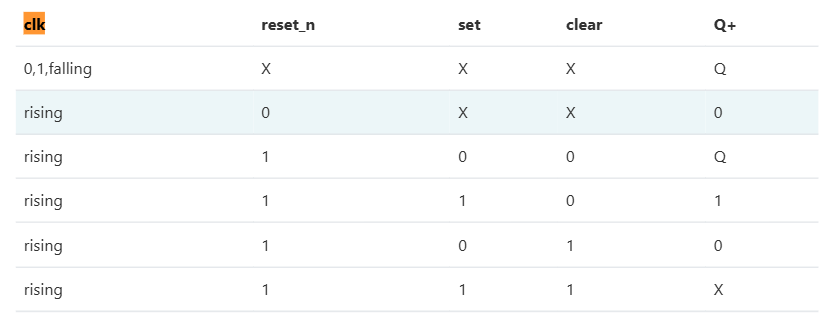
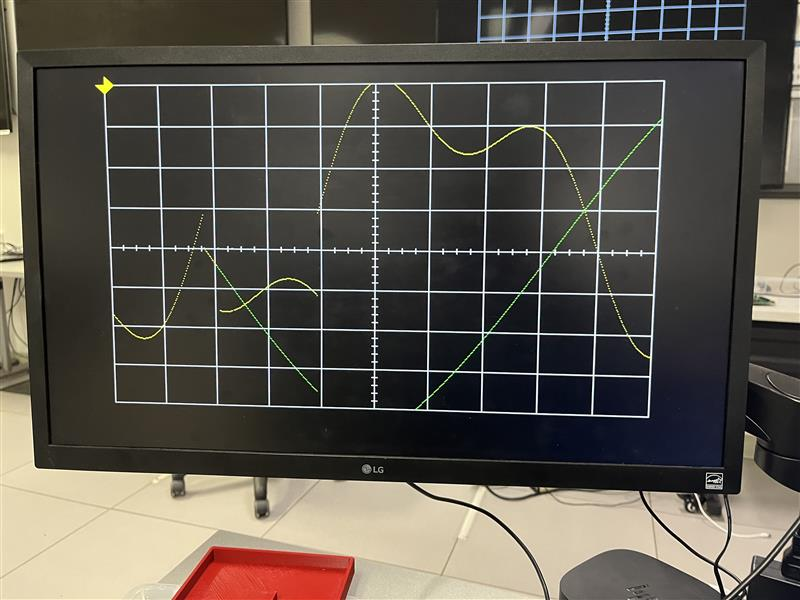

# Lab 2: Data Acquisition, Storage and Display

## Introduction:

The main goal of this lab is to integrate the video display controller module with the audio codec on the Nexys Video board to read the incoming audio signal, digitize it, and display its waveform on the monitor. To do that, the signal passes through multiple interfaces.

The input signal is passed through the Audio Codec interface, which digitizes the signal into separate 18-bit 2’s complement samples. These audio samples are then passed through the sign2unsigned component, which shifts them upward so they become positive and suitable for display and storage.

The values coming out of the sign2unsigned component are stored in the BRAM, which is later accessed by the video module and displayed on the screen. Additionally, a trigger voltage is implemented, which tells the system when to start capturing samples. This helps display a stable waveform on the screen. The point at which the waveform intersects the left edge of the grid changes by changing the trigger position.

## Design Implementation: 

### Block Diagram (Figure 1):

The block diagram includes both the datapath and the control unit. The flow in the diagram is as follows:

1- Audio_Codec_Wrapper receives audio signals from the blue line-in jack port. When data is ready, the ready signal goes high for a single clock cycle.

2- The system then checks for rising edge triggering, meaning it waits until the voltage crosses the trigger level going upward.

3- Afterwards, the audio samples are stored in the BRAM.

4- A counter is used to store audio samples at different addresses in the BRAM. The counter counts from 20 (first column in the grid) up to 620 (last column in the grid).

5- The video module sends the column of the current pixel being displayed on the screen to the BRAM. The BRAM responds with the row value where the output signal should be displayed. If the response equals the row value of the current pixel, the video module 
displays that pixel with the corresponding channel color.

6- This cycle repeats every video frame.

### Finite State Machine(Figure 2):

The FSM represents the control unit in Lab 2. In each video frame:

1- The Wait_For_Trigger state waits for the voltage to cross the trigger level upward. This is signaled by sw[2], which is tied directly to the output of the trigger_detector component.

2- Upon detection, the system transitions to the Reset_Counter state, which resets the counter to the first column in the grid (20). This is done by setting cw(1 downto 0) <= "10".

3- The system then transitions to Wait_For_Ready, where it waits until the converted data from the audio_codec is ready. This is signaled by sw[0], which is connected to the ready flag from the audio_codec.

4- Next, the system moves to the Save_Sample state, where the control unit informs the datapath to store the sample in the BRAM.

5- The counter then increments, moving the write address in the BRAM to the next memory location.

6- If the system reaches the last column in the grid (620), it transitions back to Wait_For_Trigger and repeats the process. Otherwise, it returns to Wait_For_Ready.

### Output Equation Table(Figure 3):

This screenshot shows the output of cw(2 downto 0). cw(1 downto 0) controls the counter, while cw(2) controls when the BRAM stores the audio samples. 
Counter control values:

	00 -> Hold
	01 -> Count Up
	11 -> Reset
	10 -> Load D (In this case, D = 20)

### Components: 
#### 1- BRAM_Counter:

This is a counter module built in previous labs. It counts from 20 (beginning column) up to 620 (end column). In the datapath, the counter controls the write address of the BRAM. The FSM controls the counter state, including when to count up, hold, reset, or load.

#### Inputs/outputs:

		clk     : Synchronizes the whole system
		reset   : Resets the counter
		ctrl    : controls the state of the counter
			00      -> Hold
			01      -> Count Up
			11      -> Reset
			10      -> Load D (In this case, D = 20)

		D       : Value loaded into the counter when ctrl = "10". 
		Q       : The output of the counter. In our case, the output is tied to the write address of the BRAM. 

#### 2- Flag Resister: 

The flag register will be used as a communication mechanism between Lab 2 components and the MicroBlaze processor in later labs. Lab 2 produces data, places it on a data line to the MicroBlaze, and sets the flag register using the READY signal. At some point, the MicroBlaze will read the data and clear the bit.

#### 3- trigger_detector

The trigger detector monitors the voltage and determines whether it has crossed the trigger level. It is instantiated in the datapath and allows the system to capture and store audio samples only after a specified threshold is crossed.
It compares the previous sample and the current sample to the threshold. If the previous sample is below the threshold and the current sample is above it, the signal has crossed the trigger level, and the system begins capturing samples. This ensures a stable waveform display.

#### Inputs/outputs:
        clk              : Synchronizes the whole system
        reset_n          : Resets the register holding the previos value
        threshold        : The trigger level. The monitored signal and the previos signal are compared against this value to determine if the signal has crossed the trigger level
        ready            : Indicates new audio sample is ready. This port is tied to the ready signal coming out of the audio_codec
        monitored_signal : Current audio sample. 
        crossed_trigger  : Output a signal which notifies the control unit that the signal has crossed the trigger level

## Test/Debug:

In this lab, A small test bench I created and visual observation were primarily used to test/debug my VHDL design. 

The first issue encountered was that the audio_codec_wrapper outputs 18-bit 2’s complement samples, while the BRAM expects 16-bit unsigned samples. This was fixed by converting the samples to unsigned values and flipping the MSB. Flipping the MSB effectively shifts all values up by 131072, making them positive. The result was then truncated to 16 bits by removing the two LSBs. We decided losing the two LSBs would not significantly affect the displayed waveform.

The second issue was that the waveform did not appear on the screen. A small testbench was created to observe signals in both the datapath and control unit. It turns out there were some logic errors in the code, and some signals were not connected properly in the datapath. 

Overall, my strategy was to write small pieces of code and visually verify functionality by observing the waveform output. This helped me debug my code early on before bugs accumlated. This process went smoothly, and no major bugs were observed. 

### CG1

Achieved. 
Date / Time: Lesson 14 in class. 
Demonstrated successful integration of the Lab 1 module with the BRAM. The video module successfully read left and right channel values from the BRAM and drew them on the screen when the BRAM value matched the current pixel row.
The two preset signals stored in the BRAM were displayed on the monitor. The trigger voltage and time were functional, with a debouncer implemented.

### GC2
Achieved. 
Date / Time: Lesson 15 in class. 
Demoed to instructor, and video is also uploaded under videos folder. Demonstrated that the BRAM reads the audio samples from the audio_codec. At this point, the simulated waveform appeared to be sweeping across the screen, as the trigger was not yet implemented. The waveform was centered properly using an offset.

### GC3
Achieved
Date / Time: Lesson 15 in class
Demoed to instructor in class. Demonostrated the ability to read audio signals from the audio line in-jack port, and displaying the waveform on the screen. The trigger was also implemented, which helped stabilize the output waveform. A video of gatecheck 3 is uploaded under videos folder. 

### Required Functionallity:
Acheieved
Date /Time: Lesson 15 in class
Demoed to instructor in class that the audio waveform is triggered at the trigger level. This shows that the system only captures audio samples after the signal has crossed the trigger level. FSM and datapath are properly seperated as required. Gate check 3 video uploaded demonstrates the triggering functionality. 

### B Functionallity
Acheieved
Date / Time: Lesson 16 in class.
Video is uploaded to teams, and under video folder. The video named "A_Level_Functionallity" demonstrates both B level and A level functionallity. The second channel was added in green(But no trigger is associated with this channel). The exSel and flag register was also included with their required muxes. The exSel was tied direclty to switch(2). When this switch is on, the waveform appears to be frozen on the screen. This is because the system switches to external control(MicroBlaze), which will be implemented in lab 3. 

### A Functionallity
Achieved
Date / Time: Lesson 16 in class.
Video is uploaded to teams, and under vide files. The actual trigger was established to capture the waveform. The waveform appears to be moving up and down as the trigger level changes. The trigger volt and time are implemented with a proper debouncing strategy. 

## Conclusion: 

This lab integrates the Audio_Codec_Wrapper with lab1 module. I think being able to switch between simulated signals, actual audio signals, while also implementing the trigger was really interesting. The way the code was structured and the given block diagram was helpful to ensure our success in this lab. For future iterations, while the audio_codec_wrapper looks very complex, I would challenge students to implement portions of it themselves to better understand its internal functionality rather than treating it entirely as a black box.
