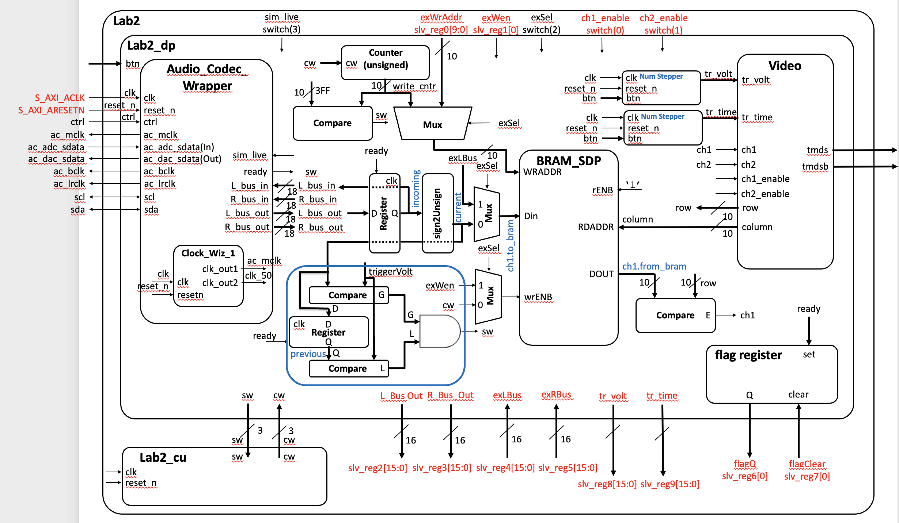
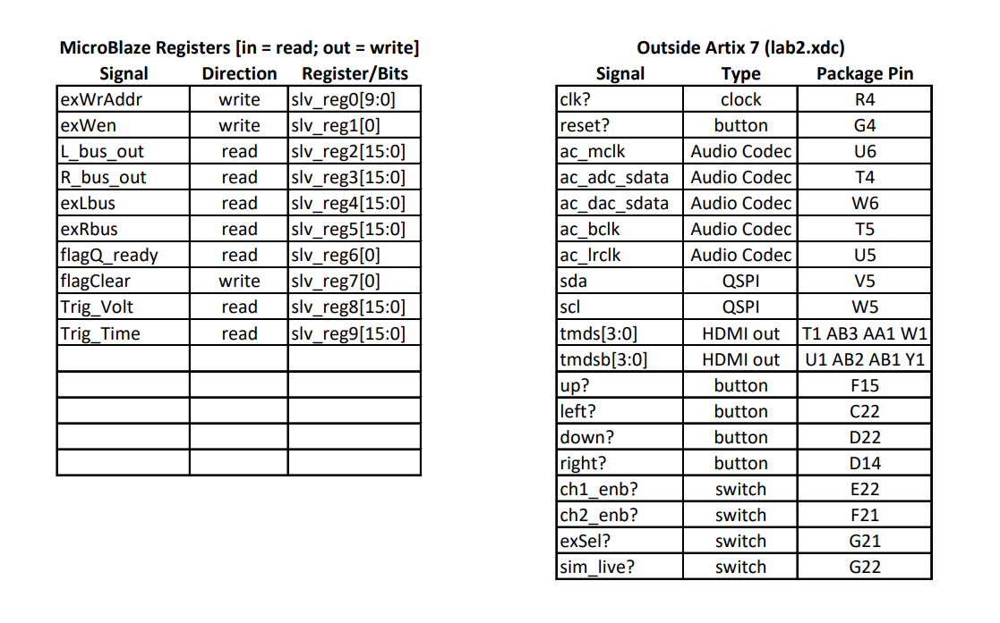
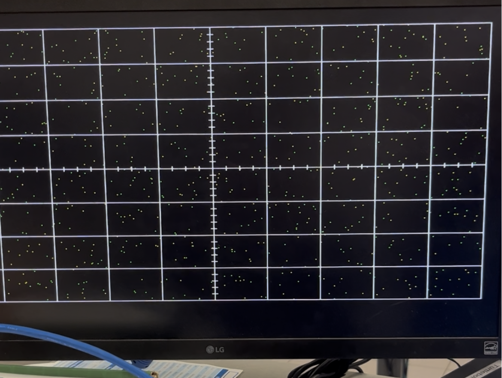
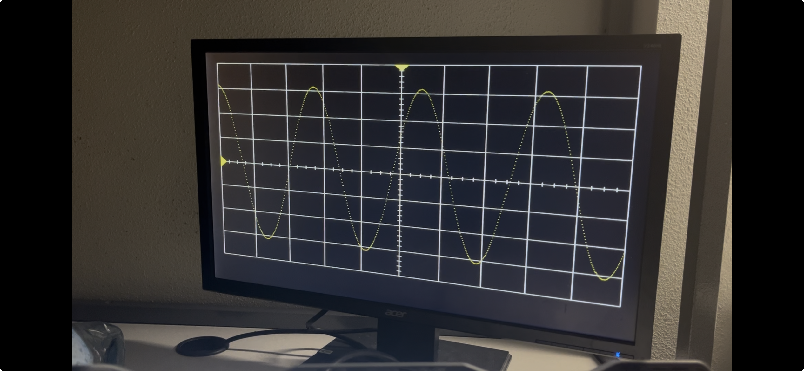

# Lab 3 README

**Design**

Updated Lab 2 block diagram with correct signals  

Mapping of 32 AXI registers to Lab 2 signals

## Functionality

Throughout this project, we verified each milestone through visual testing and inspection on the monitor. It is important to note that we also approached this project with incremental testing. 

Once we generated our hardware platform and began working in Vitis with MicroBlaze, we first drew a straight line on the display. We then used hard-coded sine curve values, and finally moved to live signal generation, working toward the full functionality of the system.

We also implemented a pair programming workflow. One person coded while actively thinking through the implementation, while the other carefully monitored for syntax errors and logical mistakes before running and testing the code.

We captured videos throughout the development process. The major milestones and progress highlights are summarized below.

| Milestone | Date / Time | What Was Achieved |
|----------|-------------|------------------|
| Gate Check 1 | March 11 - 0925 | Completion of register mapping and modified Lab 2 block diagram |
| Gate Check 2 | March 11 - 2330 | Completion of required functionality |
| Gate Check 3 | March 11 - 2330 | Completion of required functionality |
| Required Functionality | March 11 - 2330 | Required functionality verified |
| A-Level Functionality | March 13 - 0820 | Demonstrated system and fixed minor error in the find trigger function |

## Conclusion

Throughout this lab, we learned how effective pair programming can be. It helped us catch small errors quickly and significantly streamlined the debugging process.

We also enjoyed this project because it clearly demonstrated the connection between:

- **Hardware design (Vivado)**
- **Firmware control (MicroBlaze / AXI interface)**
- **Software implementation (C in Vitis)**

The project highlighted how these layers interact to create a complete system. Additionally, we both appreciated returning to C programming, as it involves a different way of thinking compared to hardware description languages and Vivado-based design workflows.
 